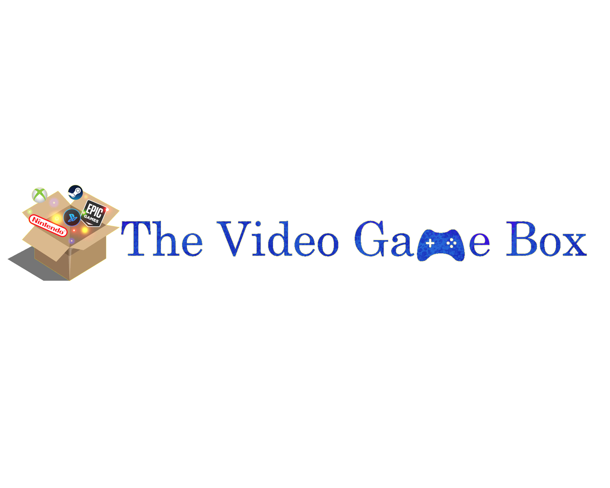

<h1 align="center">
   
  
   
  The VideoGameBox
   
</h1>

The VideoGameBox es una aplicación de escritorio enfocada a aquellas personas que tienen grandes colecciones de videojuegos y quieren poder gestionarlas y organizarlas de una manera sencilla.

## Información

La aplicación The VideoGameBox es una copia del proyecto realizado en la asignatura Gestión de proyectos software y metodologías de desarrollo (GPS) en la Universidad Complutense de Madrid. 
El proyecto fue realizado por un equipo de 10 personas empleando para ello la metodología ágil de Scrum.

## Metodología

Como bien se ha mencionado anteriormente se empleó una metodología ágil, para ser concretos **Scrum**. En la asignatura se decidió que esta metodología es la más eficiente y de las que más se usan en el ámbito laboral.

Esta metodología consiste en un equipo compuesto por profesionales interdisciplinarios que trabajan de manera colaborativa para desarrollar un producto. El equipo se organiza en **sprints**, que son ciclos cortos de trabajo, generalmente de dos a cuatro semanas de duración.

Durante cada sprint, se planifican y ejecutan las tareas necesarias para completar las **funcionalidades prioritarias** del producto. Al comienzo de cada sprint, se realiza una reunión de planificación en la que se definen los objetivos y se seleccionan las tareas a realizar.

Durante el sprint, se llevan a cabo reuniones diarias de seguimiento llamadas **daily scrums**, en las cuales cada miembro del equipo informa sobre el progreso, las dificultades encontradas y las tareas que se realizarán en el próximo día.

Al finalizar cada sprint, se realiza una **revisión** en la que se muestra el trabajo completado y se recibe **feedback** por parte de los stakeholders. También se lleva a cabo una retrospectiva en la que el equipo analiza el sprint realizado y busca mejorar su rendimiento en futuros sprints.

Además de los sprints, Scrum también incluye roles clave. En nuestro equipo, tuvimos un **Scrum Master** (José), cuya función principal fue asegurar que se siguieran las prácticas y los principios de Scrum. También contamos con un **Product Owner** (Julián), responsable de definir y priorizar los requisitos del producto.

La metodología Scrum nos permitió tener una mayor flexibilidad y adaptabilidad a medida que avanzábamos en el proyecto. Nos ayudó a enfocarnos en las funcionalidades más importantes y a entregar valor de manera incremental, permitiendo la retroalimentación constante de los usuarios.

Durante el desarrollo del proyecto, utilizamos diversas herramientas de apoyo, como **tableros Kanban** para visualizar las tareas y su estado, y herramientas de gestión de proyectos como [Jira](https://www.atlassian.com/software/jira).

En resumen, la metodología ágil de Scrum fue fundamental para el éxito de nuestro proyecto. Nos permitió trabajar de manera colaborativa, adaptarnos a los cambios y entregar un producto de calidad de manera iterativa e incremental. Aprendimos la importancia de la comunicación, la transparencia y la retroalimentación continua en el proceso de desarrollo de software.

## Cómo funciona

## Integrantes

* **Mario** Campos Sobrino
* **Carlos** Carnero Mérida
* **José** Díaz Reviejo
* **David** Elías Piñeiro
* **Carlos** Gómez López
* **Álvaro** Gómez Sittima
* **Julián** Moffatt
* **Juan** Romo Iribarren
* **Javier** de Vicente Vázquez
* **Gonzalo** Vílchez Rodríguez

